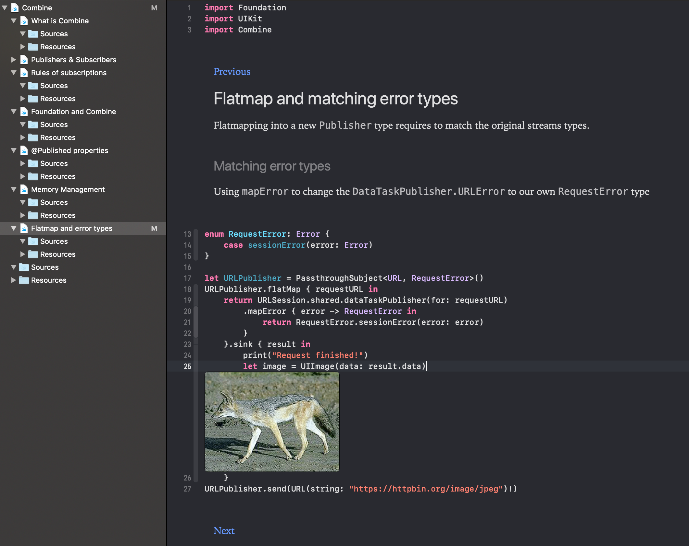

# A Swift Playground explaining the concepts of the new Combine framework
This playground will help you to get started with [Combine - Apple Developer Documentation](https://developer.apple.com/documentation/combine).

## Included in this playground
The playground is a paged playground and is built up in several chapters

- What is Combine?
- Publishers & Subscribers
- Rules of subscriptions
- Foundation and Combine
- @Published property and bindings
- Memory management explained with `AnyCancellable`
- Flatmap and matching error types
- Combining Publishers
- Future and Promises
- Custom `Publisher` and UIKit extensions
- Debugging publishers

More to come!

## Requirements
- Xcode 11 beta 4
 
## Example of a playground page

## Interesting resources
Some interesting resources regarding Combine.

- [Getting started with the Combine framework in Swift](https://www.avanderlee.com/swift/combine/)
- [Creating a custom Combine Publisher to extend UIKit](https://www.avanderlee.com/swift/custom-combine-publisher/)
- [Combine debugging using operators in Swift](https://www.avanderlee.com/swift/combine-swift/)
- [RxSwift to Apples Combine](https://medium.com/gett-engineering/rxswift-to-apples-combine-cheat-sheet-e9ce32b14c5b)
- [WWDC 2019 s721 - Combine in practice](https://developer.apple.com/videos/play/wwdc2019/721/)
- [WWDC 2019 s722 - Introducing Combine](https://developer.apple.com/videos/play/wwdc2019/722/)
- [Open Source insight of Combine](https://github.com/broadwaylamb/OpenCombine)

## Interesting Frameworks
Some interesting frameworks regarding Combine.

- [Hover - Async network layer with Combine](https://github.com/onurhuseyincantay/Hover)
- [Conbini - Custom `Publisher`s, operators, and `Subscriber`s](https://github.com/dehesa/Conbini)
